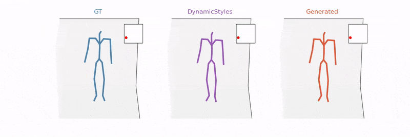

# About Me

Hello! I am an enthusiastic and driven individual who is passionate about programming, research, learning, and problem-solving. I strive to leverage my technical abilities and insatiable curiosity to tackle real-world challenges and make a positive impact through technology.

# My Loss Function

$MyLoss = D_{KL}(work||life) + patience * \left \| \left \| bugs \right \| \right \| _2$  

Maintaining a healthy work-life balance can be a daunting task for anyone, especially for programmers who are constantly grappling with debugging issues. However, I am a firm believer in the power of patience and persistence. I know that with these qualities, I can overcome any obstacle and continue to grow as a professional.

# My Projects

Here you will find a selection of my most interesting projects. Some are related to my research, while others are just for fun. Regardless, I'm proud of all of them and I hope you enjoy exploring them as much as I enjoyed creating them.

## 🪻 LILAC: Long-sequence Incremental Low-latency Arbitrary Motion Stylization

LILAC is my latest research project that extends an offline VAE–Diffusion motion stylization framework into a **real-time streaming system**. It achieves low-latency, long-sequence, and temporally consistent stylized motion generation through a causal decoding architecture. This method enables arbitrary motion stylization in real time, making it suitable for animation, avatars, and interactive systems.

The GIF below shows **long-sequence streaming stylization** results (all with trajectory copy to preserve spatial consistency for VR users): the **left** clip is the original motion, the **middle** shows real-time transfer among three styles (*old*, *open-leg*, *hands-high*), and the **right** continues the *hands-high* stylization sequence.

    

🔗 [Project Page](https://pren1.github.io/lilac/) | 📄 [arXiv Preprint](https://arxiv.org/abs/xxxx.xxxxx)

## 🎉 Empowering the Visually Impaired with an Innovative Indoor Navigation App

Introducing my iPhone app, designed to provide reliable and accurate navigation assistance to visually impaired individuals navigating indoor spaces. Utilizing advanced particle filter technology and programmed in Swift, my app offers a dependable solution for indoor navigation challenges faced by those with visual impairments.

To see the full capabilities of my app, check out this [video demonstration](https://drive.google.com/file/d/1MvOaDDGPZ5dK3lg0F4zSvck8pdmtDzPl/view?usp=sharing). I'm excited to offer this tool to empower and enhance the independence of visually impaired individuals.

    

## 💡 Deep Learning Projects

- [Pretraining BERT on Google TPU](https://github.com/pren1/A_Pipeline_Of_Pretraining_Bert_On_Google_TPU)
  A tutorial I wrote to help others take advantage of Google's fast TPUs for pretraining BERT models. With 40 stars, it's been well received!

- [MMD Variational Autoencoder](https://github.com/pren1/keras-MMD-Variational-Autoencoder)
  A MMD-VAE implemented in Keras, for unsupervised representation learning.

- [Chinese Voice Synthesizer](https://www.bilibili.com/video/BV1fS4y1k7C3/)
  A synthesizer developed for several Chinese vtubers. The demo video is available on [Bilibili](https://www.bilibili.com/video/BV1fS4y1k7C3/).

- [VAST](https://github.com/pren1/VAST)
  A model for separating mixed voices from two Japanese speakers.

- [Artificial DD](https://github.com/pren1/Artificial_dd)
  A fun project that sends context-based fake Chinese chat messages. The demo video is available on [Bilibili](https://www.bilibili.com/video/BV17J411n7Lx/).

## 💻 Machine Learning Projects

- [Emoticon Discriminator](https://github.com/pren1/Fast_naive_bayes)
  A fast implementation of a Naive Bayes classifier for emoticon discrimination.

- [Fans Kalman](https://github.com/pren1/fans_kalman)
  A Kalman filter for predicting the fans of any vtuber.

## 📖 Class Projects

- [Primary Type Classifier](https://github.com/pren1/naive_bayes)
  A primary type classifier based on Naive Bayes.

- [JPCT Demo](https://github.com/pren1/JPCT_demo)
  A face model render app for Android, with detailed documentation.

## 🌟 Machine Learning Tutorials

I also write tutorials on basic machine learning topics, such as SVM, logistic regression, and Naive Bayes. These are available on [Bilibili](https://www.bilibili.com/read/readlist/rl619919) (in Chinese).

# Get in Touch

If you have any questions or just want to chat about my projects, please feel free to reach out to me via my email. I would love to hear from you and discuss any questions or feedback you may have. 

Thank you for visiting my GitHub page, and I look forward to hearing from you soon!
